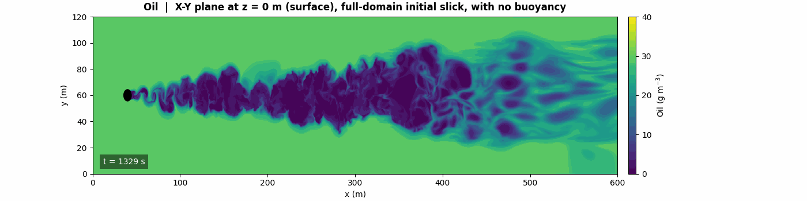

# Monopile tracer

Passive tracer transport through the wake of an offshore monopile, using
archived LES velocity. The LES itself is not part of this work; everything
here is post-processing of it.



*A slick covering the entire surface, with vertical mixing active. Green is
untouched oil at its initial concentration; the dark track is where the pile
has mixed oil downward out of the surface layer.*

Four studies share the same velocity field, and the first three share the
same advection code:

| | |
|---|---|
| `oil_spill/` | surface oil, four cases |
| `tracer_transport/nitrate_fulldomain/` | a nutrient profile through the wake |
| `tracer_transport/vertical_diffusivity/` | flux-gradient estimate of `Kz` |
| `vorticity/` | vorticity and speed animations |

Each has its own ReadMe with parameters, results, and how to run it.

## The velocity field

Large-eddy simulation by Yongxing Ma, at
`/shared_folder/yongxing/OpenFOAM/simulationCases/flow_past_cylinder/realistic_cases/domain_D8X600Y120/uniform`.

| | |
|---|---|
| Domain | 600 × 120 × 40 m |
| Monopile | D = 8 m at (40, 60), spanning the full depth |
| Freestream | approx 0.5 m/s, vertically uniform |
| Bed | slip, so no bottom boundary layer |
| Sides | slip or symmetry at y = 0 and y = 120 |
| Storage | decomposed across 256 processors, about 1.87 TB |

Measured cross-stream velocity at the side walls is about 2×10⁻⁵ m/s against
0.067 m/s mid-domain, so nothing crosses them.

The raw output is on an unstructured mesh. Everything here works from a
regular grid binned out of it by the scripts in `scripts/`.

## Extraction

All five scripts do the same job with different windows and resolutions. They
read the decomposed OpenFOAM output in parallel, bin cell values onto a
regular grid, and write one `npz` per timestep. All reuse
`velocity_450_cache.npz`, which holds the cell centres — the mesh is static,
so they are read once and reused for every timestep.

| Script | Window | Grid |
|---|---|---|
| `extract_full_025.py` | 0–600 m | 2400 × 480 × 84 at 0.25 m — **current** |
| `extract_full.py` | 0–600 m | 1200 × 240 × 84 at 0.5 m |
| `extract_new.py` | 0–290 m, y 15–115 | 1160 × 400 × 84 |
| `extract_resolved.py` | 20–290 m | 1080 × 400 × 84 |
| `extract_resolved_x0.py` | 0–290 m | 1160 × 400 × 84 |

The progression runs from narrow and coarse to full-domain and fine. The later
scripts exist because each study needed more of the domain than the one before
it.

Empty bins are filled by nearest neighbour. At 0.25 m about 60% of cells are
filled this way, which matters for any quantity involving a spatial derivative
— vorticity in particular is noisier than one computed on the native mesh.

## Resolution limit

The LES mesh is refined out to x ≈ 290 m and coarsens to 1–3 m beyond. Past
roughly x = 350 m the figures show large-scale displacement of tracer rather
than resolved turbulent filaments. Confirmed as expected by Yongxing.

In pile diameters that is a usable range of about x/D = 35 — a reasonable
near-to-intermediate wake, but not a far-wake study.

## The advection scheme

Eulerian, continuous, semi-Lagrangian with trilinear interpolation. No
diffusion term: background diffusivity is set to zero, so any mixing that
appears is resolved transport rather than something prescribed.

The scheme is bounded by construction, so a tracer cannot overshoot its own
initial range. It is not exactly conservative, and the binned velocity field
is not perfectly divergence-free, so total mass drifts by a few percent over a
352-step run.

Boundary treatment differs by face, and matters more than it looks:

| Face | Treatment |
|---|---|
| Inlet | zero inflow for a finite release; holds its initial value for a continuous one |
| Sides | clipped — they are no-flux in the LES, so this is adequate |
| Surface and bed | **reflected, not clipped** |

A parcel whose departure point lies above the free surface actually came from
just below it. Clipping returns it to the surface cell, which duplicates
tracer wherever there is downwelling. Reflection is the correct treatment for
a no-flux boundary and conserves mass.

This only matters when vertical velocity is active — but it matters a lot when
it does. About 57% of surface cells have downward `w`, with displacements up
to 0.10 m against a cell height of 0.265 m.

## What the studies found

### Oil spill

Two limits bracket the behaviour of a surface slick, because the model has no
rise velocity and cannot say where between them real oil sits.

**With buoyancy imposed** — vertical velocity zeroed — a slick released
upstream stays at the surface and is stretched and folded by the wake. Its
footprint grows substantially over the run while total mass is conserved, so
the apparent fading is dilution rather than loss.

**With no buoyancy**, the pile clears essentially all the oil out of the
surface layer in the near wake. Surface concentrations in the wake core fall
close to zero. Nothing returns it, so this is the maximum possible surface
clearing.

A slick covering the **entire surface** shows no signature at all under
horizontal advection alone. That is not a null result to be explained away:
translating a horizontally uniform field leaves it uniform, so there is no
edge to distort and no gradient to stretch. The same case with vertical mixing
active produces the clearest figure in the set — the wake reads as a depletion
track through an otherwise untouched sheet, widening downstream and breaking
into discrete vortex structures.

Taken together: a surface slick passing a monopile is affected mainly through
vertical mixing, not horizontal stirring. How much depends entirely on the
oil's buoyancy, which this model does not represent.

### Vertical diffusivity

Method implemented following sections 5.1–5.4 of Yongsheng's document:
Reynolds decomposition of vertical velocity and tracer, layer-averaged
turbulent flux, then a least-squares flux–gradient fit.

A short test run gives `Kz` of order 10⁻³ m²/s, uniform to within a factor of
two over the water column. **That figure is provisional** — it comes from 30
of 352 timesteps and the full runs are still going.

Two things are already clear from the test. Levels near the surface and bed
carry no information, because the cosine initial profile has zero gradient
there, so they have to be masked rather than reported. And the choice of
averaging operator matters: a time mean and a layer mean give diffusivities
differing by a factor of about 1.7. Which one section 5.1 intends is an open
question.

### Nitrate

Thirteen animations of an AZMP nitrate profile advected through the wake,
produced to Yongsheng's specification — he chose the nutricline depths and the
plane list. Interpretation of what they show is his; this repository holds the
method and the output.

### Vorticity and speed

Two-panel animations built for Gloria Wang at Yongxing's request, using the
same extraction. Plan view at mid-depth over a streamwise section along the
pile centreline.

## Practical notes

Python environment: `/home/andyhe/tracer_env/bin/python`

Scripts run from their case folder, not from `scripts/`, because the paths
inside them are relative.

Advection runs need 20–30 GB at their startup peak and take about seven hours
for 352 steps on a 2400 × 480 grid. The machine is shared; check `free -g`
before launching, since the OOM killer picks the largest process and several
runs have been lost that way.

Run detached so a job survives the terminal closing:

```bash
setsid nohup /home/andyhe/tracer_env/bin/python -u scripts/foo.py \
    > render.log 2>&1 < /dev/null &
```

The shell prints `Done` immediately when you do this. That means detached, not
finished — use `pgrep` to see what is actually running.

Print a running diagnostic every N steps: a total, a maximum, anything. Three
separate boundary-condition faults in this code were caught purely because a
printed mass total was climbing when it should have been flat. None of them
would have been visible in the figures.

Velocity data, advection caches and rendered animations are excluded from
version control for size. The scripts regenerate them.
