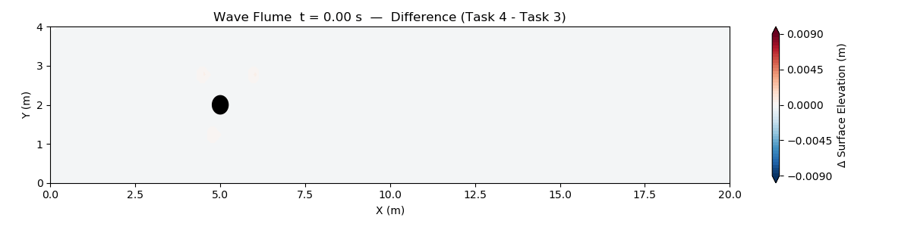

# ocean-cfd

Co-op project at the Bedford Institute of Oceanography (Fisheries and Oceans Canada), looking at how offshore structures stir up the water around them.

There are two things going on in here:

**Wave flume simulations** in OpenFOAM / waves2Foam. Regular waves, a cylinder sitting in the flume, and combined wave plus current cases.

**Passive tracer transport.** This one takes archived LES velocity from a monopile in a steady current and uses it to push a passive tracer around, so you can watch how the wake behind the structure redistributes material through the water column.

## Some results

The cleanest way to see what the cylinder actually does is to subtract the empty flume from the cylinder case. Whatever is left over is purely the structure's doing:

Same idea for a steady current instead of waves:

Tracer animations coming once those runs finish.

## What is where

| | |
|---|---|
| `task1_regularFlume/` -> `task4_cylinder_current/` | the OpenFOAM cases |
| `compare_difference*.py` | difference animations between task pairs |
| `parameter_study/` | wave parameter sweep, with its own MANIFEST |
| `archive/` | superseded cases and figures |

The tracer work lives in `../monopile_tracer/` at the repository root.

Mesh files, `processor*/`, and the numeric time directories are all gitignored since they are big and regenerable. Run `blockMesh` and `decomposePar` to get them back.

## Built with

* [OpenFOAM](https://www.openfoam.com/) v2412
* [waves2Foam](https://github.com/ogoe/waves2Foam) for wave generation and relaxation zones. Note this is the fork, not upstream, built from `a8d38fd`.
* [olaFlow](https://github.com/phicau/olaFlow) for the earlier monopile work, built from `a35bc3d`.

Python side is just `numpy`, `scipy`, `matplotlib`, and `pandas`.

## A couple of notes

The binned velocity fields and the rendered animations are not tracked here. They run to tens of GB and can be regenerated from the case output.

The tracer starts from a real nitrate profile, Atlantic Zone Monitoring Program station HL5 on the Halifax Line. That data is publicly available from DFO, so it is not redistributed here.
